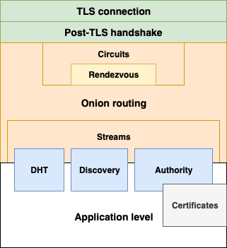

# PeerStream Protocol (PSP) Specification

## Overview

[PeerStream protocol overview](overview/overview.md)

## Protocol layers

### Onion layer

[TLS connection and post-TLS handshake](flows/tls.md)

[Onion routing](binary/cell.md)

[Circuits](flows/circuits.md)

[Rendezvous](relay/rendezvous.md)

[Streams](flows/streams.md)

[Media Streams](flows/media.md)

### Application layer

[:white_check_mark:] [Application level events](application/application.md)

[:x: Incomplete] [Certificates](application/certificate.md)

[:white_check_mark:] [DHT subsystem](application/dht.md)

[:white_check_mark:] [Authority subsystem](application/authority.md)

[:white_check_mark:] [Discovery subsystem](application/discovery.md)

---

(c)2018-2019 PeerStream Inc.
