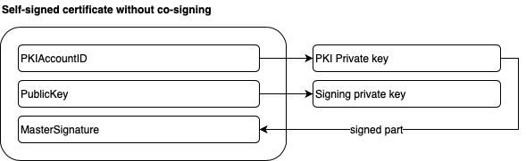
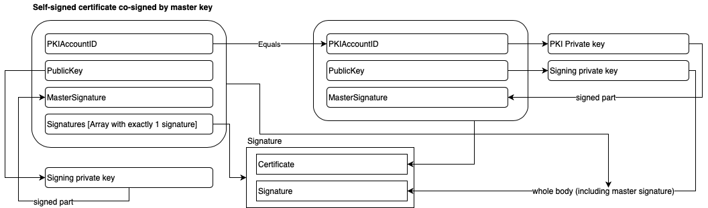
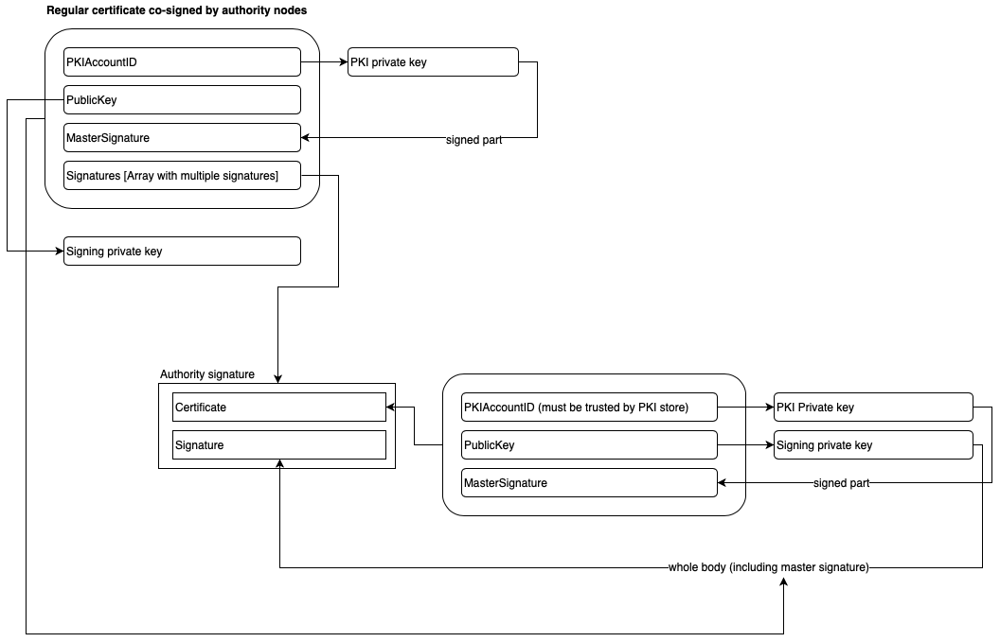
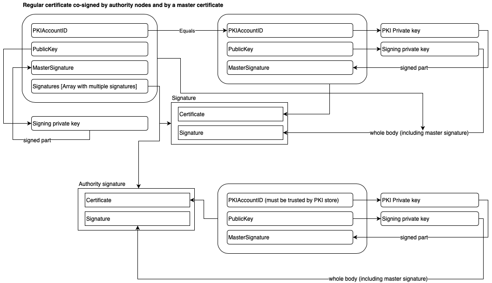

# Certificate formats supported on PSP network

## Certificates

Certificates are used across the PSP protocol and used by all parts of the system to confirm their identity issuing application
level protocol events.  Certificate is an integral part of [signed message](signedmessage.md) containing a binary message, a signature,
and a validating certificate confirming the signature.  Certificates divide into two groups - self signed certificates signed by
the account private key directly or signed by a long term signing key co-signed by the account private key (master key); and regular
certificates co-signed by number of authority nodes.  System in general does not trust self-signed certificates for the identity (except
for the number of built-in identities for authority and discovery nodes public keys for whose are built in into the SDK) and all participants
must obtain regular certificates co-signed by a number of authority nodes containing not less amount of signatures than the minimum requirement
of the system.

## Self-signed plain certificate

## Self-signed co-signed with a master key

## Regular without co-signed portion

## Regular co-signed with a master key

