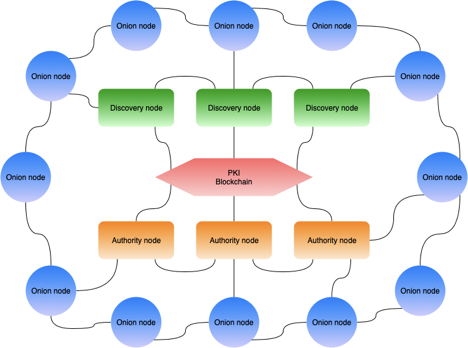
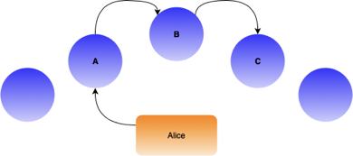
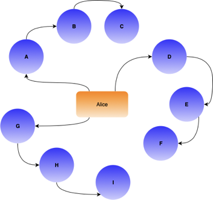
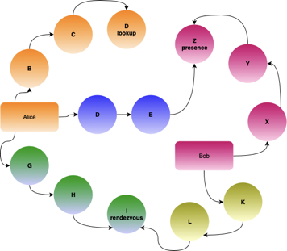
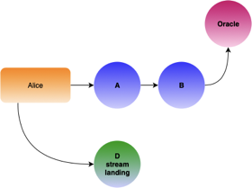
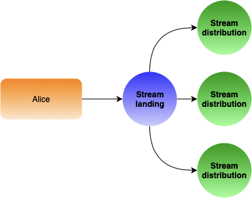

# Peer Stream Protocol.  Privacy Communication layer

## Intro

PeerStream Protocol (PSP) is a distributed decentralized streaming protocol that is designed to provide real-time decentralized streaming and messaging layer for distributed applications engaged with privacy and security features. PSP is capable of encapsulating different kinds of namespaced protocols and designed to provide applications with anonymity, privacy and security features including and not limited to end-to-end encryption, user-to-user authentication and meta-data termination.  PSP provides a way for applications and users to communicate with one another anonymously where all user sensitive metadata is disassociated in all communication and streaming sessions. Examples of types of metadata that are protected are user identities and IP addresses. Privacy in PSP is primarily focused on dissociating the link between the users identities and their IP addresses. This prevents any network node from associating a user's IP address with the user's identification.

There are two different levels of privacy used in PSP:

- The first level provides full anonymity, and used by default for one to one messaging, all session negotiation and creation. An anonymous layer is built on top of modified TOR protocol, utilizing a hidden service approach and no exit nodes.
- The second level is a private, partially anonymous multimedia streaming layer based on proprietary PeerStream protocol. The streaming layer does not provide IP address anonymity, in favor of providing low latency and high quality real-time streaming. Network nodes serving the communication are able to access IP addresses of neighboring nodes in the session. However, information about user identities involved and entire session content is end-to-end encrypted to fulfill anonymity.

This document defines various parts of PeerStream Protocol and details the two different privacy routing levels used. Economic aspect (rewards system) of the PSP protocol is out of scope of this description.

## 1. PSP network nodes

All PSP nodes are organized into a loosely connected mesh network where some of the nodes are connected with some of the other nodes. Nodes are designed to maintain internode connections when required and drop unused connections and re-establish when required again. Some PSP nodes are publicly accessible via one or several public network interfaces, Some PSP nodes serve as internal nodes and could only be used as interim or final hops in the system. PSP is capable of using any PKI layer as the public key infrastructure (PKI) to store, authenticate, validate both client and node cryptographic identifiers, and support the node reward system.

fig.1. Generalized PSP structure diagram.

PSP nodes play different kinds of roles in the PSP network. Some nodes are created to serve one role where others could be elected to play more than one role in the network.

### 1.1.  PSP Node Roles

- General availability (onion) nodes. Onion nodes are used as entry and interim nodes for creating and extending onion routes, to create and distribute streams, and to announce and manage online points of presence for clients of the system.
- Discovery nodes. Some trusted nodes are selected as the discovery nodes providing the signed node listing for all the clients wishing to operate on the network. These are critical nodes as the discovery role is a security sensitive role.
- Authority nodes. Some of the nodes are elected as authority nodes, acting as a bridge to the PKI store and performing as an authorization source for other nodes and clients of the system. In order to run one or more authority nodes, it is a requirement to have a stake in the system.

Future extension:

- Oracle nodes. Oracle nodes are acting as network validators collecting and confirming node bandwidth utilization and running the node rewards scheme.
- Commercial nodes. Application specific nodes providing off-chain dynamic business logic support for applications.
- Bridge nodes. Bridge nodes act as regular onion nodes however those nodes are not listed on a publicly available node digest and allowing users to join the network from the countries blocking the mainstream entry nodes. Those nodes could only be used as the system entry points.

## 2. Discovery service

The root for any onion routed protocol is a trusted discovery service mechanism allowing all participants to obtain a fresh and valid list of all available nodes on the network. From security perspective PSP nodes participating in discovery process are acting as privileged nodes, identified and elected using different mechanisms than any other nodes playing other different roles in the PSP network. Secure discovery node election is a critical process, essential to eliminate the possibility of having malicious or compromised nodes providing a list containing only malicious nodes to clients. This protects the security and privacy of both user and application.
The final list of discovery nodes is established by electing a number of trusted long standing nodes. A full list of discovery nodes is available publicly. The default core set of discovery nodes is built in into the client. Client requires a fixed amount of signatures from known discovery nodes to be present on a directory listing. The signatures are used so that the listing may be trusted as valid, and also for use in building routes.
Every node in the network is able to proxy discovery requests. Applications are encouraged to perform discovery requests from any other known node to balance the load to the root discovery servers.
All kinds of nodes playing different roles in the PSP network are reporting their status periodically to all known discovery nodes they can reach. Discovery nodes do a voting and build consensus periodically every 15 minutes to form a new list of nodes and sign the list with their discovery keys. Such periodically generated list of nodes will contain full list of all public nodes, node flags,node addresses (for entry nodes, if available) and geographic locations.

## 3. DHT presence information storage

In order for clients to be able to announce the presence and/or lookup availability information for other users, the system needs a distributed data storage available from any node. To achieve that all nodes participate in a distributed hash table (DHT) based on S/Kademlia algorithm with security modifications. Nodes are bootstrapping the DHT using publicly available discovery information and reseeding it during the session performing periodical DHT queries to the random distinct node from the most recent discovery digest.
In order to prevent unauthorized modifications of data on the DHT layer every record on a table is signed by the record owner and co-signed by the node originally publishing the record. The record owner is defined as the originator of the record, which can be a client, node or group identity. Both nodes and consuming clients only accept data that they are able to validate, confirm the ownership of and verify the signature of. Every record on the DHT is assigned with an expiration time and must periodically be renewed to continue to be listed. Once a record expires, it gets automatically wiped by all the nodes.

## 4. Participant identity and authority certificates

Any participating (node, privileged node or end user application) identity is represented by the namespace, application namespace and public key identifying the client entity on a PKI store. Altogether, those parameters are used to form a string identifier in **peerstream.client.account.2Kny61ghn2upK8ttFwVoeHmicHEA6SfQjXC1HDUtuTGVdea2FF**. Every identity can be validated against the system PKI store using a set of authority nodes. This results in building a temporary access certificate, which allows a client to operate on a system signing announcements and introduction requests using his identity.

## 5. Commercial user identity nodes

Some applications could decide to provide additional services for a subset of their clients outside the scope of default system functionality (centralized or enterprise class of use). An application developer will be able to provide a set of custom (enterprise/commercial) nodes capable of processing custom protocol requests and being reachable by corresponding end user applications. Information for these nodes will be published on a PKI store and nodes could be located using regular discovery mechanism.

## 6. Client registration and announcing presence at the network

### 6.1. Onion routing

Client applications use onion routing approach to hide the user IP address from various parts of the system. In order to build the route, the client decides on all the nodes on the path he’s going to use and telescopically extends the path from one node to another node by node implementing Curve25519 elliptic curve exchange to build a session key for each new hop over the encrypted TLS pipe (from the client to the entrance node and from node to node for all interim nodes). All the messages on the onion routing layer are being passed within fixed 512 byte boundary slots.very node on a network limits the send rate so the onion routing layer cannot be used for passing real-time multimedia data. It can only be used for the presence/signaling layer and direct user-to-user private messaging.

### 6.2. Announcing presence on the system: anonymous way

In order for a client to establish its presence on the system without revealing his network identity, we detach the user presence node from his real entrance point. To do that, the client registers several points of contact for itself. Further in the document, these points will be known as presence nodes. To do that, a client discovers 3 independent node on the network. The client then chooses which node becomes his entrance node, which node becomes his presence node and proceeds to build an onion route (fig.2) towards the destination.

fig. 2. Announcing the presence.

In the example above, Alice chooses node A as an entrance node and node C as her presence node. Initially, Alice connects to the node A anonymously, using the handshake key from node A. This link is then used to establish the elliptic curve Diffie-Hellman key exchange, creating a session key K between Alice and A. After a secure connection is established, Alice requests node A extend the connection on her behalf, reaching node B. Alice then requests node A extend to further reach node C where Alice reveals her identity, signing the registration message with her access certificate. Alice then then announces herself using Node C as the presence point for her across the entire network of nodes using the DHT storage mechanism. Announcement is co-signed by the node and assigned some expiration time. Alice then can renew the presence registration by sending keep-alive events over that channel periodically. Alice should be able to register multiple presence endpoints for herself for fault tolerance purposes. Clients discovering her should be able to choose which entries are most recent and be able to contact one or several of them.

fig. 2.1. Multiple points of presence

### 6.3. Announcing presence on the system: Public way

If full anonymity is not required, a client is able to establish the presence on the very first hop without building a multi-hop route and using PSP stream instead. This mechanism does not hide the relation between client IP address and his public identity.

## 7. Client discovery and private exchange

### 7.1. Private way

Assuming that Bob established his presence point at node Z (fig. 3), we can now describe the process Alice uses to discover and reach him in a secure manner. This mechanism prevents revealing that these users are communicating to any observer, including the nodes participating in session.  

fig. 3. Client discovery and communication.

In order to perform this, Alice first chooses 3 additional nodes B, C, and D. Alice uses the created circuit to perform a “user lookup” request in an anonymous manner, receiving a list of Bob’s presence points. After obtaining the list, Alice then builds similar route G, H, and I using I as the destination node. Once the circuit is built, Alice establishes it as a rendezvous point, delivering half-sequence initialization for the new session with Bob.
After establishing the rendezvous point and learning Bob’s presence nodes, Alice then extends the new route D, E towards one of Bob’s presence nodes (Z) forming a new circuit D, E, Z. After that, Alice creates the introduction request containing her identity and rendezvous point,. She then encrypts it using Bobs announcement key. Finally, she delivers it through the route so only Bob will be able to unwrap the message without revealing to node Z that the original sender is Alice.
If Bob accepts the request, he creates a new circuit K, L, and I ending up with rendezvous node I. He then completes the second half of the secure connection, resulting in the creation of a new secure channel between Alice and Bob that is only known to the two users involved.
Due to the anonymous nature of those communication channels, a node itself is unable to validate the authenticity of the incoming connection request. Therefore, each communication channel has to be approved by the receiving client application. This is done by limiting the amount of creation requests being processed by the single node at any given moment of time and allowing node to be able to request cancellation for any request. This results in immediate termination of a route built from the other client to the presence node. Clients should also be able to specify the rate limit for every communication channel created allowing the presence node to throttle the data volume and specify the hard channel limit, capping the amount of channels created to the single presence of the client. The client should be notified about reaching the cap, so he has the opportunity to register more presence endpoints if needed.

### 7.2. Public entity

Public entity discovery is no different from discovering the private party since both announcement mechanisms work similarly. Client then can use both secure (7.1) or direct mechanisms to connect the party depending on advertised flags. The direct mechanism is defined as connecting directly using the stream to the presence node of a public entity. Client, connecting publicly to the privately announced party, will only reveal the location, but not the identity, of the connecting person to the presence node. However, it will not reveal the real location of the other client, as long as the other client connected using the secure mechanism to announce his presence.
Clients not wishing to hide their identity may use a direct stream to the rendezvous point node.

## 8. Video stream publishing

### 8.1. Video stream definition

Even though clients are able to utilize the secure messaging layer (7.1) to deliver private messages, users will potentially need a way to create real-time streams for client to client or group communications. Real-time streams are unidirectional video distribution fan-outs allowing clients to broadcast the video stream to one or multiple viewers. Fan-outs could be stacked together forming a distributed network allowing to scale the stream delivery to as many users as required.

### 8.2. Real-time unidirectional stream creation

In order to create a real-time stream, the client creates an anonymous route towards any of the oracle nodes using any of them to perform the creation node request (fig. 4)

fig. 4. Stream creation route

Alice builds a AB[O] route to any known oracle node, revealing her identity to it. Then, oracle node [O] verifies Alice’s subscription status and creates the anonymous stream creation request receipt. The anonymous stream creation request receipt contains allowed parameters but not containing any Alice’s identity information. It is then signed with node [O] oracle key. The oracle node stores, and distributes amongst all other oracle nodes, the resulting receipt ID along with Alice’s identity information for the future use. Alice then abandons the route and connects to another node D anonymously. She the delivers the stream creation request, along with the oracle’s identity so node D is able to validate the request, decoding it with node [O] key. Node D is thusly able to create the anonymously validated stream without knowing the stream owner identity. For the public stream node then publishes the stream registration information along with the format flags on a DHT layer, signing it with the node key, for the private stream the client is responsible for delivering that seed information himself.
Detaching the creation request from the presence node will allow the node to validate Alice’s subscription status and sign the creation request with its own key (node [O] key on fig. 4) without revealing the identity for Alice.
While registering a stream, a client may optionally provide the stream distribution node set. Stream landing node D then will register those nodes with the system as access points for the stream (fig. 5). Nodes will communicate about the bandwidth available and scale the distribution set as needed, requesting the originating user to provide more distribution nodes if needed.

fig. 5. Streams landing/distribution scheme.

Doing so further detaches the stream origin from stream landing point and allows load balancing for better distribution.
Stream is then encoded with the temporary stream key thus forming a pair <stream id> and <stream key> known only to the stream producer. Clients who want to access the stream should obtain both values from the client or group privately over the independent secure channel in order to be able to establish the receiving side and to be able to decode and read contents of the stream for consumption.

### 8.3. Stream usage reporting

In order to consume the stream, clients must obtain the temporary oracle identification ID . The client then builds an onion route towards any of oracle nodes and solves the puzzle to generate a random session identifier not related to their identity.
Oracle identification ID must be reported and validated upon connecting to the distribution side of a stream. Validation requires checking the signature and validity timestamp. Later, the identification ID would be used by both the distribution node and the client to report actual usage of the traffic towards the oracle network. This enables monitoring of real bandwidth usage by the nodes and rewards participating parties for carrying the bandwidth. Calculated stream usage should be normalized to prevent clients from misreporting the traffic volumes.
